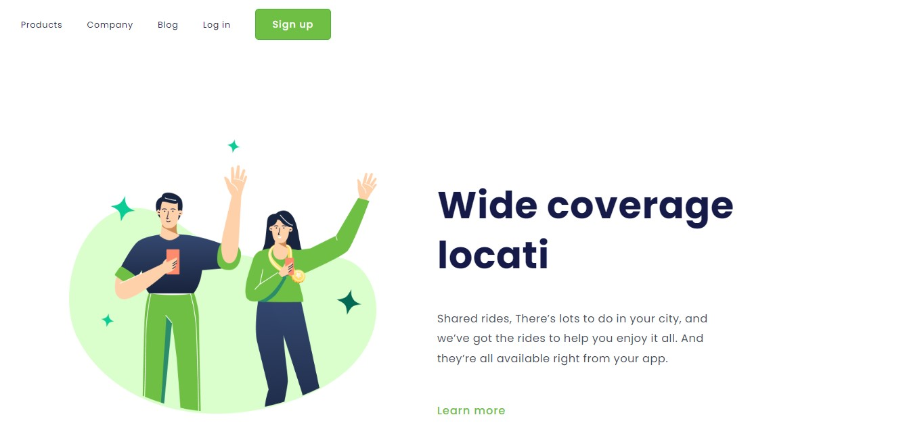

# Desafio do CSS do DEVCLUB

Desafio de uma página simples estática para trabalha com HTML e CSS

## Tecnologias Utilizadas
* HTML
* CSS
* VSCode (IDE)
* Figma

## Imagem do projeto

## Contato

  
     

